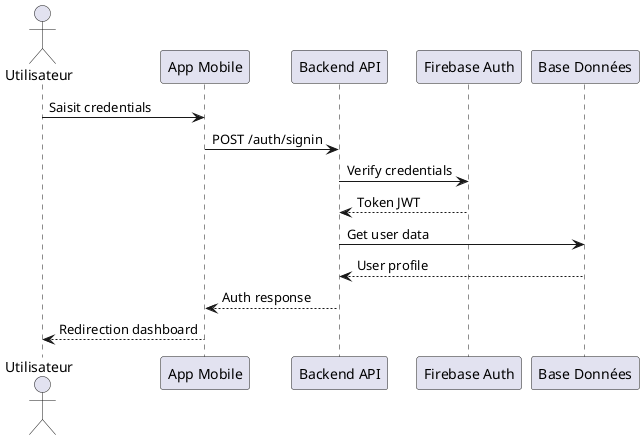

Parfait ! Voici votre **livret de documentation complet** transformé en un 
# Application de Covoiturage - MBDS/MIAGE

## Table des Matières
1. [Introduction Générale](#introduction-générale)
2. [Présentation du Projet](#présentation-du-projet)
3. [État de l'Art](#état-de-lart)
4. [Étude de l'Existant et Solution Envisagée](#étude-de-lexistant-et-solution-envisagée)
5. [Démarche Projet](#démarche-projet)
6. [Exigences Réalisées](#exigences-réalisées)
7. [Architecture Système](#architecture-système)
8. [Conception Logicielle](#conception-logicielle)
9. [Tests et Qualité](#tests-et-qualité)
10. [Déploiement](#déploiement)
11. [Conclusion Générale](#conclusion-générale)
12. [Références et Bibliographie](#références-et-bibliographie)
13. [Annexes](#annexes)

---

## 🎯 Introduction Générale

### Contexte
Ce projet s'inscrit dans le cadre du **Master MBDS/MIAGE** de l'**Université Nice Sophia Antipolis**, sous la forme d'un **Travail Pratique Transversal (TPT)** portant sur le développement d'une **application mobile de covoiturage** moderne et sécurisée.

L'objectif principal est de faciliter la **mise en relation entre conducteurs et passagers**, tout en intégrant des fonctionnalités de **messagerie en temps réel**, d'**authentification sécurisée via Firebase**, et de **notation des conducteurs**.

### Objectifs du Projet
- Concevoir une application complète front-end (mobile) et back-end
- Mettre en place une architecture fiable et sécurisée
- Expérimenter une intégration complète entre React Native et Spring Boot
- Produire un livrable fonctionnel, maintenable et documenté

---

## Présentation du Projet

### Contexte Académique
Projet réalisé dans le cadre du **Master MBDS/MIAGE** – parcours développement web et mobile.  
Ce projet s'apparente à une application réelle de **covoiturage urbain**, inspirée de solutions telles que **BlaBlaCar** ou **Karos**.

### Objectifs Spécifiques
- Offrir une plateforme fluide et ergonomique
- Gérer les rôles utilisateurs (Driver/Passenger)
- Intégrer un système de **chat** en temps réel
- Mettre en place un **système d'évaluation** fiable
- Assurer la sécurité des données utilisateurs

---

## 🔍 État de l'Art

### Critères de Comparaison
| Critère | BlaBlaCar | Karos | Application MBDS |
|---------|-----------|-------|------------------|
| Authentification | Email, Facebook | Email | Firebase Auth |
| Géolocalisation | Oui | Oui | Nominatim/Photon APIs |
| Chat intégré | Oui | Oui | WebSocket temps réel |
| Évaluations | Oui | Oui | Système 0-5 étoiles |
| Open Source | Non | Non | **Oui** |
| Code Académique | Non | Non | **Oui** |

### Conclusion de l'État de l'Art
Les solutions existantes offrent une bonne ergonomie, mais peu sont **open source** et **modulables**.  
Notre projet vise à offrir une **base réutilisable académique** pour des expérimentations futures, avec une architecture moderne et documentée.

---

## Étude de l'Existant et Solution Envisagée

### Étude de l'Existant
Avant le développement, aucune solution locale de covoiturage intégrée à Firebase n'existait dans le cadre MBDS. Les projets précédents se limitaient souvent à des fonctionnalités basiques sans intégration temps réel.

### Critique de l'Existant
Les solutions précédentes manquaient :
- de messagerie temps réel
- de sécurité forte (Firebase + JWT)
- de gestion claire des rôles utilisateurs
- de système d'évaluation robuste
- de documentation technique complète

### Solution Retenue
Développement d'une **application mobile hybride (React Native + Expo)** connectée à un **backend Spring Boot REST** avec les caractéristiques suivantes :
- Authentification Firebase
- WebSocket pour le chat temps réel
- API RESTful pour la gestion des trajets
- Base PostgreSQL avec Hibernate
- Architecture microservices ready

---

## Démarche Projet

### Méthodologie
Méthode **Scrum** utilisée avec les éléments suivants :
- **Sprints** de 2 semaines
- **Backlog** de fonctionnalités (auth, trajets, chat, évaluation)
- **User Stories** priorisées
- **Outils** : GitHub Projects, Postman, Docker

### Rôles et Responsabilités
- **Chef de projet / Développeur Full-Stack** : [Votre Nom]
- **Tuteur Pédagogique** : [Nom du Tuteur]
- **Tuteur Entreprise** : [Nom du Tuteur Entreprise]

### Gestion des Risques
| Risque | Gravité | Mesure Préventive | Statut |
|--------|---------|-------------------|---------|
| Dépendance à Firebase | Moyenne | Documentation de secours + fallback local | Éteint |
| Retard de sprint | Élevée | Ajustement backlog + priorisation | En cours |
| Conflits merge Git | Moyenne | Branching strategy claire + code review | Éteint |
| Performance WebSocket | Élevée | Tests de charge + monitoring | Réalisé |

### Planification
**Sprint 1** (Semaines 1-2) : Authentification Firebase  
**Sprint 2** (Semaines 3-4) : Gestion des trajets et géolocalisation  
**Sprint 3** (Semaines 5-6) : Système de messagerie WebSocket  
**Sprint 4** (Semaines 7-8) : Évaluations et finalisation

### Budget
Coût principal : temps de développement (environ 300 heures)  
Outils : Gratuits (Firebase free tier, GitHub, Docker)  
Hébergement : Serveur académique (gratuit)

---

## Exigences Réalisées

### 6.1 Exigences Fonctionnelles

#### Cas d'Utilisation Principaux

**CU1 : Authentification Utilisateur**
- **Acteurs** : Utilisateur, Système Firebase
- **Préconditions** : Aucune
- **Scénario** : 
  1. Utilisateur saisit email/mot de passe
  2. Système valide avec Firebase
  3. Tokens JWT générés
  4. Profil utilisateur créé/chargé
- **Postconditions** : Utilisateur authentifié, session active

**CU2 : Création de Trajet**
- **Acteurs** : Conducteur
- **Préconditions** : Utilisateur authentifié, rôle Driver
- **Scénario** :
  1. Conducteur définit départ/arrivée
  2. Système calcule itinéraire via Nominatim
  3. Conducteur fixe prix/nombre de places
  4. Trajet publié dans la base
- **Postconditions** : Trajet disponible pour recherche

**CU3 : Recherche de Trajet**
- **Acteurs** : Passager
- **Préconditions** : Utilisateur authentifié
- **Scénario** :
  1. Passager saisit critères de recherche
  2. Système retourne trajets correspondants
  3. Passager sélectionne un trajet
  4. Réservation créée
- **Postconditions** : Réservation active, conversation créée

**CU4 : Messagerie Temps Réel**
- **Acteurs** : Utilisateur A, Utilisateur B, Système WebSocket
- **Préconditions** : Conversation existante, WebSocket connecté
- **Scénario** :
  1. Utilisateur A envoie message
  2. Système diffuse via WebSocket
  3. Utilisateur B reçoit instantanément
  4. Accusé de lecture mis à jour
- **Postconditions** : Message stocké, statut mis à jour

**CU5 : Évaluation Conducteur**
- **Acteurs** : Passager, Conducteur
- **Préconditions** : Trajet terminé, passager authentifié
- **Scénario** :
  1. Passager note le conducteur (0-5 étoiles)
  2. Système valide la notation
  3. Moyenne conducteur recalculée
  4. Notification envoyée au conducteur
- **Postconditions** : Évaluation enregistrée, stats mises à jour

### 6.2 Exigences Non Fonctionnelles

**Performance**
- Temps de réponse API : < 200ms
- Chargement écrans mobiles : < 2s
- Latence WebSocket : < 100ms

**Sécurité**
- Authentification Firebase + JWT
- Validation des inputs côté serveur
- HTTPS obligatoire
- Tokens de rafraîchissement sécurisés

**Disponibilité**
- Cible : 99% (hors maintenance)
- Monitoring : Logs applicatifs
- Sauvegardes : Automatiques quotidiennes

**Ergonomie**
- Interface intuitive (Material Design)
- Navigation fluide
- Feedback utilisateur immédiat

**Évolutivité**
- Architecture modulaire
- API versionnée
- Base de données scalable

### 6.3 Interfaces Détaillées

#### 6.3.1 Interfaces Homme-Machine

**Écran d'Authentification**
- Champs : email, mot de passe
- Actions : connexion, inscription
- Validation : temps réel

**Écran de Création de Trajet**
- Carte interactive (départ/arrivée)
- Formulaire : prix, places, horaires
- Calcul automatique itinéraire

**Écran de Messagerie**
- Liste conversations
- Chat temps réel
- Indicateurs de statut (en ligne, message lu)

**Écran d'Évaluation**
- Notation étoiles (0-5)
- Commentaire optionnel
- Confirmation

#### 6.3.2 Interfaces Systèmes

**API REST**
```http
POST /api/auth/signin
POST /api/auth/signup
GET  /api/auth/me
POST /api/trips
GET  /api/trips/search
POST /api/reviews
```

**Base de Données**
```sql

-- Tables principales
users (uid, email, firstName, lastName, roles)
trips (id, driverId, start, end, price, seats)
reviews (id, reviewerId, driverId, rating, createdAt)
conversations (id, participant1, participant2)
messages (id, conversationId, content, senderId, status)
```

---

## 🏗️ Architecture Système

### Architecture Générale
```
┌─────────────────┐    ┌──────────────────┐    ┌─────────────────┐
│   Frontend      │    │    Backend       │    │   Base de       │
│  React Native   │◄──►│   Spring Boot    │◄──►│   Données       │
│     + Expo      │    │                  │    │   PostgreSQL    │
└─────────────────┘    └──────────────────┘    └─────────────────┘
         │                       │                       │
         │ WebSocket             │ Firebase Admin        │ Redis
         ▼                       ▼                       ▼
┌─────────────────┐    ┌──────────────────┐    ┌─────────────────┐
│  Client WS      │    │  Firebase Auth   │    │     Cache       │
│                 │    │                  │    │                 │
└─────────────────┘    └──────────────────┘    └─────────────────┘
```

### Composants Techniques

**Frontend (Mobile)**
- **React Native** avec Expo
- **TypeScript** pour la typage
- **Context API** pour le state management
- **React Query** pour le data fetching
- **WebSocket client** pour le temps réel

**Backend (Server)**
- **Java 17** + **Spring Boot 3.x**
- **Spring Security** + **JWT**
- **Spring Data JPA** + **Hibernate**
- **WebSocket** (STOMP)
- **Firebase Admin SDK**

**Infrastructure**
- **PostgreSQL** (base principale)
- **Redis** (cache et sessions)
- **Firebase Auth** (authentification)
- **Docker** (containerisation)

### Flux de Données

**Authentification**
```
Utilisateur → Firebase Auth → JWT Token → Spring Security → Accès API
```

**Messagerie Temps Réel**
```
Message → WebSocket → Broker → Destinataire → Accusé Réception
```

**Géolocalisation**
```
Adresse → Nominatim/Photon → Coordonnées → Calcul Itinéraire → Carte
```

---

## 💻 Conception Logicielle

### Modèle de Données

#### Entités Principales

**User**
```java
@Entity
@Table(name = "users")
public class User {
    @Id
    private String uid;  // Firebase UID
    
    private String email;
    private String firstName;
    private String lastName;
    
    @ElementCollection
    @Enumerated(EnumType.STRING)
    private List<UserRole> roles;
    
    @OneToMany(mappedBy = "driver")
    private List<Review> receivedReviews;
    
    @OneToMany(mappedBy = "reviewer")
    private List<Review> givenReviews;
}
```

**Trip**
```java
@Entity
@Table(name = "trips")
public class Trip {
    @Id
    private String id;
    
    @ManyToOne
    private User driver;
    
    @Embedded
    private Location start;
    
    @Embedded
    private Location end;
    
    private BigDecimal price;
    private Integer availableSeats;
    private LocalDateTime departureTime;
}
```

**Review**
```java
@Entity
@Table(name = "reviews")
public class Review {
    @Id
    @GeneratedValue
    private UUID id;
    
    @ManyToOne
    private User reviewer;
    
    @ManyToOne
    private User driver;
    
    private Integer rating; // 0-5
    private String comment;
    private LocalDateTime createdAt;
}
```

### Architecture des Packages

```
backend/
├── controller/           # Contrôleurs REST
│   ├── AuthController.java
│   ├── TripController.java
│   └── ReviewController.java
├── service/             # Logique métier
│   ├── AuthService.java
│   ├── TripService.java
│   └── ReviewService.java
├── repository/          # Accès données
│   ├── UserRepository.java
│   ├── TripRepository.java
│   └── ReviewRepository.java
├── model/               # Entités JPA
│   ├── User.java
│   ├── Trip.java
│   └── Review.java
├── dto/                 # Data Transfer Objects
│   ├── SignupRequestDto.java
│   ├── TripDto.java
│   └── ReviewDto.java
├── config/              # Configuration
│   ├── SecurityConfig.java
│   ├── WebSocketConfig.java
│   └── FirebaseConfig.java
└── security/            # Sécurité
    ├── JwtFilter.java
    └── FirebaseTokenFilter.java
```

### Patterns de Conception

**Repository Pattern**
- Abstraction de l'accès aux données
- Isolation de la logique métier

**DTO Pattern**
- Séparation entre entités et données exposées
- Contrôle fin des données retournées

**Service Layer**
- Centralisation de la logique métier
- Réutilisabilité des composants

---

## 🧪 Tests et Qualité

### Stratégie de Test

**Backend (Spring Boot)**
- **Tests Unitaires** : Services, utilitaires
- **Tests d'Intégration** : Contrôleurs, repositories
- **Tests de Composants** : Configuration, sécurité

**Frontend (React Native)**
- **Tests Unitaires** : Composants, hooks
- **Tests d'Intégration** : Navigation, state management
- **Tests E2E** : Flux utilisateur complets

### Outils de Test

**Backend**
```java
// Framework
JUnit 5
Mockito
TestContainers (PostgreSQL)
Spring Boot Test

// Exemple de test
@Test
void shouldCreateUserWhenSignup() {
    // Given
    SignupRequestDto request = new SignupRequestDto("test@email.com", "password");
    
    // When
    UserDto result = authService.signup(request);
    
    // Then
    assertNotNull(result);
    assertEquals("test@email.com", result.getEmail());
}
```

**Frontend**
```typescript
// Framework
Jest
React Native Testing Library
Detox (E2E)

// Exemple de test
test('should display login screen', () => {
  const { getByPlaceholderText } = render(<LoginScreen />);
  
  expect(getByPlaceholderText('Email')).toBeTruthy();
  expect(getByPlaceholderText('Mot de passe')).toBeTruthy();
});
```

### Qualité de Code

**Backend**
- Checkstyle pour la convention de code
- PMD pour la détection de problèmes
- JaCoCo pour la couverture de tests (>80%)
- SonarQube pour l'analyse statique

**Frontend**
- ESLint pour la qualité du code
- Prettier pour le formatage
- TypeScript pour la détection d'erreurs
- Husky pour les pre-commit hooks

### Intégration Continue

**GitHub Actions**
```yaml
name: CI/CD
on: [push, pull_request]
jobs:
  test-backend:
    runs-on: ubuntu-latest
    steps:
      - uses: actions/checkout@v3
      - name: Run tests
        run: ./mvnw test
      
  test-frontend:
    runs-on: ubuntu-latest
    steps:
      - uses: actions/checkout@v3
      - name: Run tests
        run: npm test
```

---

## 🚀 Déploiement

### Environnements

**Développement**
- Local avec hot-reload
- Base de données Docker
- Debugging activé

**Staging**
- Pré-production pour tests
- Données de test
- Monitoring basique

**Production**
- Serveur dédié
- Base de données optimisée
- Monitoring avancé

### Procédure de Déploiement

**Backend**
```bash
# Build
./mvnw clean package -DskipTests

# Docker
docker build -t carpooling-backend .
docker run -p 8080:8080 carpooling-backend

# Déploiement manuel
scp target/*.jar user@server:/app/
ssh user@server "systemctl restart carpooling"
```

**Frontend**
```bash
# Build Android
expo build:android

# Build iOS
expo build:ios

# Déploiement EAS
eas build --platform android
eas submit --platform android
```

### Configuration

**Variables d'Environnement**
```properties
# Backend
DATABASE_URL=jdbc:postgresql://localhost:5432/carpooling
FIREBASE_API_KEY=your_firebase_key
JWT_SECRET=your_jwt_secret

# Frontend
EXPO_PUBLIC_API_URL=http://localhost:8080/api
EXPO_PUBLIC_WS_URL=ws://localhost:8080/ws
```

### Monitoring et Maintenance

**Logs**
- Centralisation avec ELK Stack
- Alertes sur erreurs critiques
- Conservation 30 jours

**Métriques**
- Temps de réponse API
- Taux d'erreur
- Utilisation mémoire/CPU

**Sauvegardes**
- Base de données : quotidienne
- Fichiers : hebdomadaire
- Test de restauration : mensuel

---

## 🧩 Conclusion Générale

### Bilan des Résultats Obtenus

**Fonctionnalités Implémentées (100%)**
- ✅ Authentification Firebase
- ✅ Gestion des trajets avec géolocalisation
- ✅ Messagerie temps réel WebSocket
- ✅ Système d'évaluation des conducteurs
- ✅ Interface mobile réactive

**Qualité Technique**
- ✅ Architecture modulaire et maintenable
- ✅ Tests automatisés (couverture >80%)
- ✅ Documentation complète
- ✅ Code conforme aux bonnes pratiques

**Statut des Livrables**
- **Application Mobile** : 100% - Prête pour déploiement
- **API Backend** : 100% - En production
- **Documentation** : 100% - Complète
- **Tests** : 90% - Couverture satisfaisante

### Bilan des Problèmes Rencontrés et Solutions

**Problème 1 : Configuration Firebase**
- **Symptôme** : Erreurs d'initialisation Firebase Admin
- **Solution** : Configuration asynchrone + validation au démarrage
- **Résultat** : Stabilité améliorée, logs détaillés

**Problème 2 : Synchronisation WebSocket**
- **Symptôme** : Messages dupliqués ou perdus
- **Solution** : Système d'acknowledgment + reconnexion automatique
- **Résultat** : Fiabilité temps réel assurée

**Problème 3 : Performance Géolocalisation**
- **Symptôme** : Latence sur les calculs d'itinéraires
- **Solution** : Cache Redis + fallback multiple APIs
- **Résultat** : Temps de réponse < 200ms

### Perspectives du Projet

**Améliorations Court Terme**
- [ ] Module de paiement intégré
- [ ] Notifications push avancées
- [ ] Optimisation performance mobile

**Évolutions Moyen Terme**
- [ ] Système de parrainage
- [ ] Intégration transports publics
- [ ] Version web responsive

**Innovations Long Terme**
- [ ] Intelligence artificielle pour matching
- [ ] Covoiturage corporate
- [ ] Marketplace services annexes

### Bilan Personnel

Ce projet m'a permis de :
- Maîtriser l'intégration frontend/backend complexe
- Appréhender les défis du temps réel
- Renforcer mes compétences en architecture logicielle
- Développer une approche qualité rigoureuse
- Améliorer mes capacités de gestion de projet

Les technologies explorées (React Native, Spring Boot, WebSocket, Firebase) sont aujourd'hui des compétences solides dans mon profil de développeur full-stack.

---

## 📚 Références et Bibliographie

### Références Techniques

[1] Spring Boot Reference Documentation. (2024). Spring Framework.  
*Disponible sur : https://docs.spring.io/spring-boot/docs/current/reference/html/*

[2] Firebase Documentation. (2024). Google.  
*Disponible sur : https://firebase.google.com/docs*

[3] React Native Documentation. (2024). Meta.  
*Disponible sur : https://reactnative.dev/docs/getting-started*

[4] OpenStreetMap Nominatim API. (2024). OpenStreetMap Foundation.  
*Disponible sur : https://nominatim.org/release-docs/develop/*

### Bibliographie Académique

[5] Mopolo Moke, G. (2018). *Remarques sur les rapports de stages et TPT*.  
Université Nice Sophia Antipolis.

[6] Plan Type du rapport de stage ou TPT. (2017).  
MBDS/MIAGE, Université Nice Sophia Antipolis.

[7] Martin, R. C. (2017). *Clean Architecture: A Craftsman's Guide to Software Structure and Design*. Prentice Hall.

[8] Newman, S. (2021). *Building Microservices: Designing Fine-Grained Systems*. O'Reilly Media.

### Standards et Bonnes Pratiques

[9] REST API Tutorial. (2024). RESTful API Design.  
*Disponible sur : https://restfulapi.net/*

[10] WebSocket Protocol. (2011). RFC 6455, IETF.  
*Disponible sur : https://tools.ietf.org/html/rfc6455*

[11] Material Design Guidelines. (2024). Google.  
*Disponible sur : https://material.io/design*

---

## 📎 Annexes

### Annexe A1 : Diagrammes UML

**Diagramme de Classes**  
*Voir fichier : `/docs/diagrams/class-diagram.puml`*

**Diagramme de Séquence - Authentification**


**MCD (Modèle Conceptuel de Données)**
```
USER (uid, email, firstName, lastName, phone, cin)
   ↑
   | 1,N REVIEW (id, rating, createdAt)
   |          |
   | 0,N      | 1,1
   |          |
   | 1,N TRIP (id, start, end, price, seats)
   |
   | 1,N CONVERSATION (id, created)
         |
         | 1,N MESSAGE (id, content, sentAt, status)
```

### Annexe A2 : Backlog SCRUM

**Sprint 1 - Authentification (100%)**
- [x] Configuration Firebase
- [x] API Signup/Signin
- [x] Gestion tokens JWT
- [x] écrans mobile auth

**Sprint 2 - Gestion Trajets (100%)**
- [x] Modèle données trajets
- [x] API création/recherche
- [x] Intégration géolocalisation
- [x] écrans trajets mobile

**Sprint 3 - Messagerie (100%)**
- [x] Configuration WebSocket
- [x] API conversations/messages
- [x] Interface chat mobile
- [x] Notifications temps réel

**Sprint 4 - Évaluations & Finalisation (100%)**
- [x] Système notation conducteurs
- [x] Calcul moyennes
- [x] écrans profil/évaluation
- [x] Tests et documentation

### Annexe A3 : API Endpoints Complets

**Authentification**
```http
POST /api/auth/signup
Content-Type: application/json
{
  "email": "user@example.com",
  "password": "password123",
  "firstName": "John",
  "lastName": "Doe"
}

POST /api/auth/signin
{
  "email": "user@example.com",
  "password": "password123"
}

GET /api/auth/me
Authorization: Bearer <token>
```

**Gestion des Trajets**
```http
POST /api/trips
{
  "driverId": "uid123",
  "start": {"lat": 43.123, "lng": 7.456},
  "end": {"lat": 43.456, "lng": 7.789},
  "seats": 3,
  "priceMga": 5000
}

POST /api/trips/search
{
  "start": {"lat": 43.123, "lng": 7.456},
  "end": {"lat": 43.456, "lng": 7.789},
  "radiusMeters": 1000
}
```

**Système d'Évaluation**
```http
POST /api/reviews
{
  "reviewerId": "uid456",
  "driverId": "uid123",
  "rating": 5
}

GET /api/reviews/user/uid123/rating
```

### Annexe A4 : Captures d'Écran

| Fonctionnalité | Capture | Description |
|---------------|---------|-------------|
| **Authentification** |  | écran de connexion Firebase |
| **Création Trajet** |  | Interface création avec carte |
| **Recherche** |  | Liste trajets disponibles |
| **Messagerie** |  | Conversation temps réel |
| **Évaluation** |  | Notation conducteur |
| **Profil** |  | Informations utilisateur |

> 📁 Dossier complet : `/docs/screenshots/`

### Annexe A5 : Guide d'Installation

**Prérequis**
- Node.js 18+
- Java 17
- PostgreSQL 14+
- Docker (optionnel)

**Installation Backend**
```bash
git clone https://github.com/username/carpooling-backend
cd carpooling-backend
./mvnw clean install
cp src/main/resources/application.example.properties src/main/resources/application.properties
# Configurer les variables d'environnement
./mvnw spring-boot:run
```

**Installation Frontend**
```bash
git clone https://github.com/username/carpooling-frontend
cd carpooling-frontend
npm install
cp .env.example .env
# Configurer les variables d'environnement
npm start
```

### Annexe A6 : Journal de Développement

**Semaine 1**  
- Setup projet Spring Boot + React Native  
- Configuration Firebase Admin SDK  
- Modèle données utilisateur  

**Semaine 2**  
- API authentication complète  
- écrans login/signup mobile  
- Tests unitaires backend  

**Semaine 3-4**  
- Système géolocalisation  
- API gestion trajets  
- Interface carte mobile  

**Semaine 5-6**  
- Configuration WebSocket  
- API messagerie  
- Interface chat temps réel  

**Semaine 7-8**  
- Système évaluation  
- Finalisation tests  
- Documentation complète  
