# Application de Covoiturage - Manuel d'Utilisation

## Table des Matières
1. [Première Connexion](#première-connexion)
2. [Recherche de Trajets](#recherche-de-trajets)
3. [Proposer un Trajet](#proposer-un-trajet)
4. [Messagerie](#messagerie)
5. [Système d'Évaluation](#système-dévaluation)

---

## Première Connexion

### Écran de Connexion


Interface d'authentification avec champs email et mot de passe

### Création de Compte
1. **Lancez l'application**
2. **Cliquez sur "S'inscrire"**
3. **Remplissez le formulaire :**

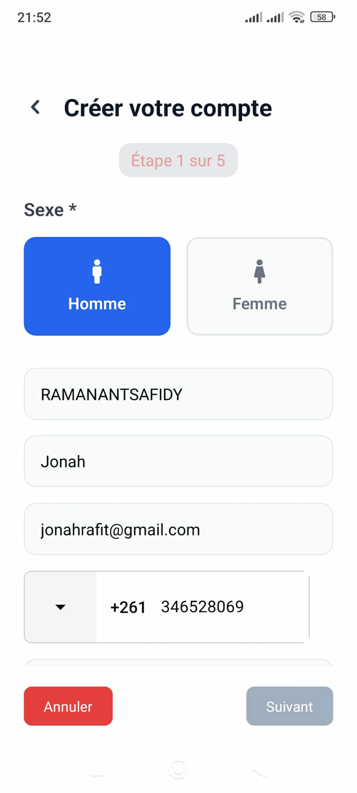
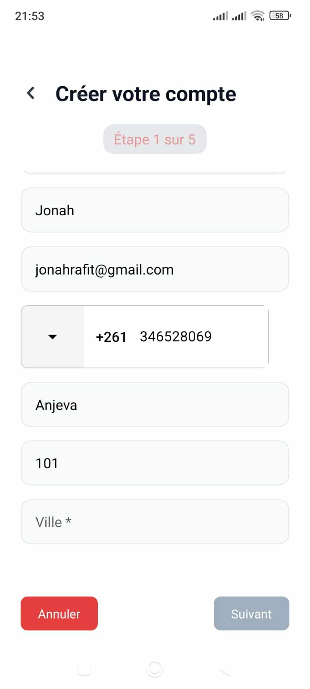
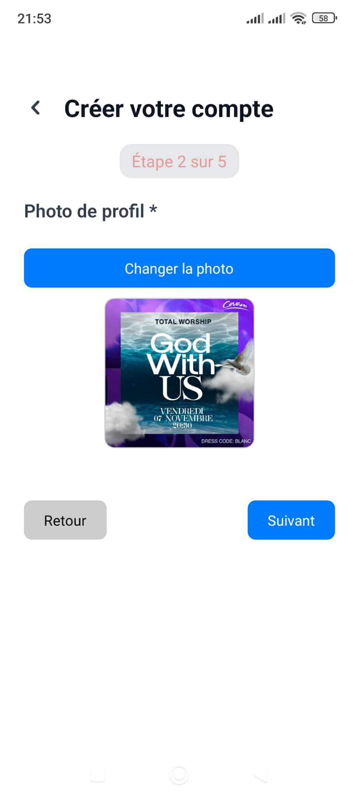
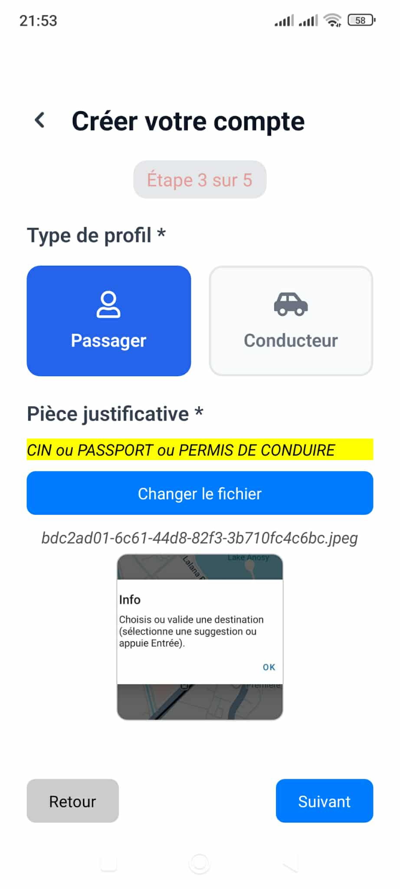
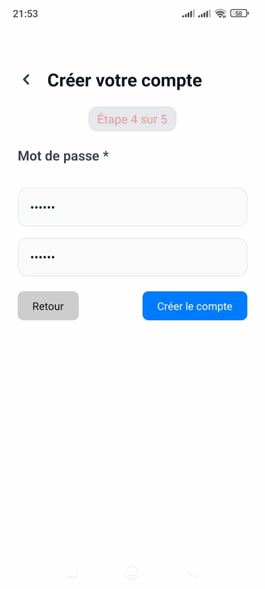
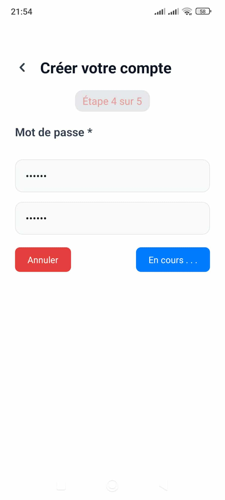
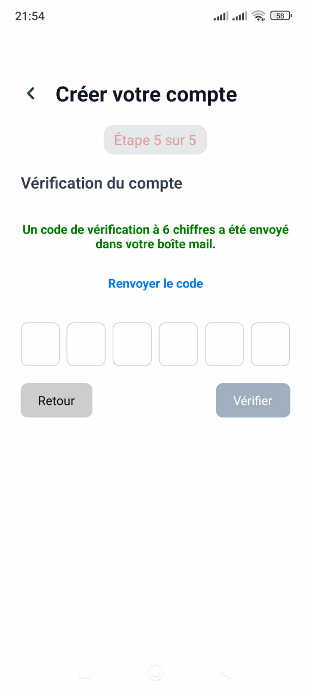

Formulaire d'inscription avec tous les champs requis

```json
{
  "email": "votre@email.com",
  "password": "votre_mot_de_passe",
  "firstName": "Votre Prénom",
  "lastName": "Votre Nom",
  "phoneNumber": "+33123456789",
  "cinNumber": "123456789012",
  "gender": "Votre genre",
  "justificatifUrl": "pièce justificatif",
  "city": "Votre ville",
  "codePostal": "Votre code postal",
  "address": "Votre adresse",
  "roles": ["PASSENGER"]
}
```

### Dashboard après Connexion

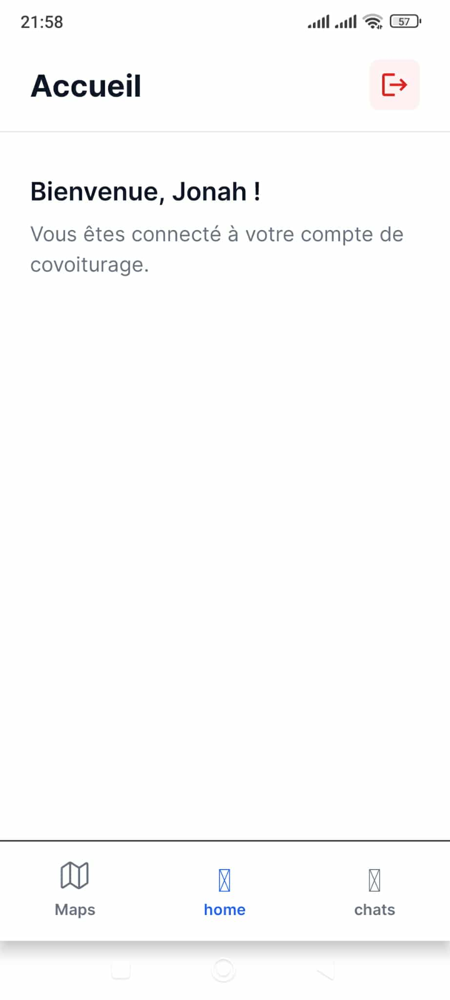

Écran d'accueil après connexion réussie avec navigation

---

## Recherche de Trajets

### Interface de Recherche

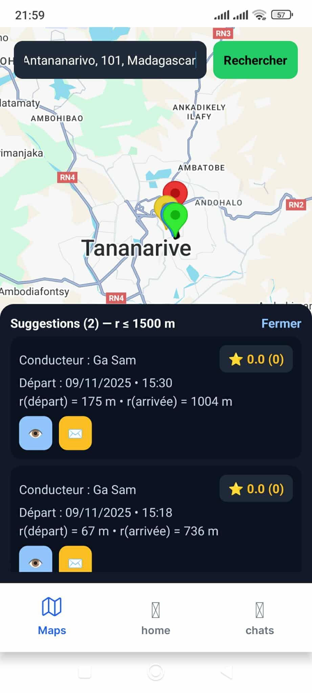

Écran de recherche avec carte et filtres

### Résultats de Recherche
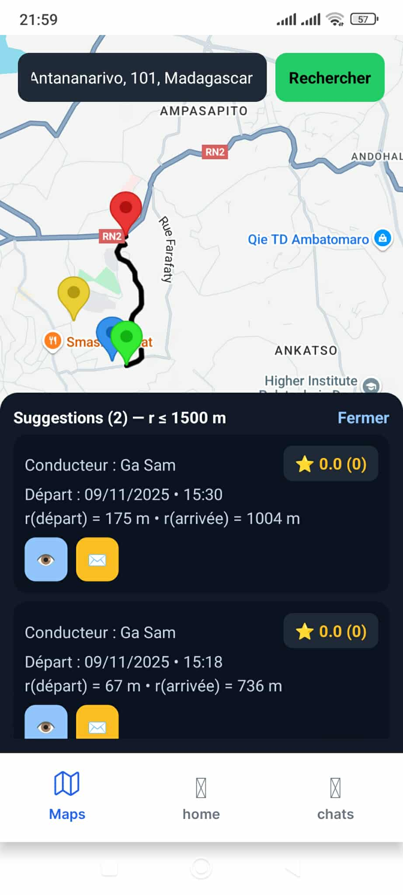

Liste des trajets disponibles avec informations détaillées

## Proposer un Trajet

### Création de Trajet
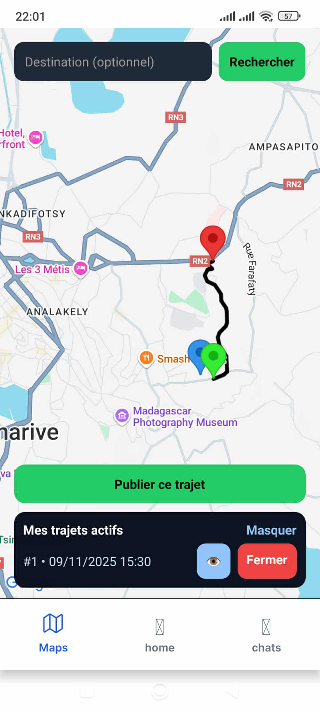
Formulaire de création d'un nouveau trajet

---

## Messagerie

### Liste des Conversations
*Liste des conversations avec indicateurs de statut*

**Indicateurs visuels :**
- En ligne /  Hors ligne
- Statut des messages

### Interface de Chat
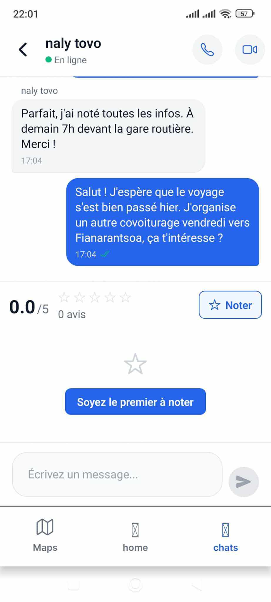
Interface de discussion en temps réel

### Envoi de Message
*Zone de saisie de message avec bouton d'envoi*

**Statuts des messages :**
- ✓ Envoyé (gris)
- ✓✓ Livré (gris)  
- ✓✓ Lu (bleu)

---

## Système d'Évaluation

### Interface d'Évaluation*


Écran de notation avec système d'étoiles

### Profil avec Notes

Page de profil affichant la note moyenne

**Informations affichées :**
- Note moyenne (ex: 4/5)
- Nombre total d'avis

---

## Support

### En Cas de Problème
1. **Vérifiez la connexion internet**
2. **Redémarrez l'application**

### Logs Techniques
- **Logs React Native** pour mobile
- **Endpoints de test** disponibles

---