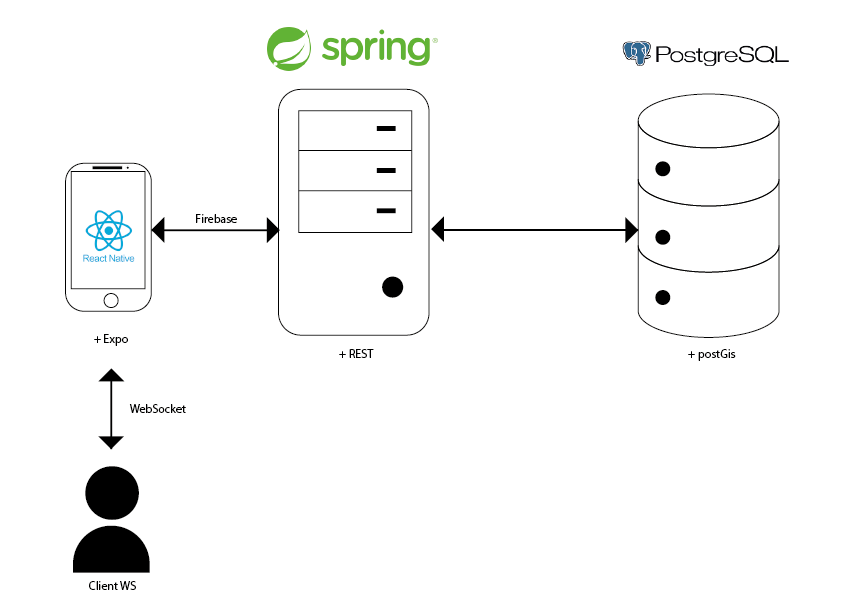

# Collaborative Commuting

## Table des Matières

1. [Introduction Générale](#introduction-générale)
2. [Présentation du Projet](#présentation-du-projet)
3. [État de l'Art](#état-de-lart)
4. [Étude de l'Existant et Solution Envisagée](#étude-de-lexistant-et-solution-envisagée)
5. [Démarche Projet](#démarche-projet)
6. [Exigences Réalisées](#exigences-réalisées)
7. [Architecture Système](#architecture-système)
8. [Conception Logicielle](#conception-logicielle)
9. [Tests et Qualité](#tests-et-qualité)
10. [Déploiement](#déploiement)
11. [Conclusion Générale](#conclusion-générale)
12. [Références et Bibliographie](#références-et-bibliographie)
13. [Annexes](#annexes)

---

## 🎯 Introduction Générale

### Contexte

Ce projet s'inscrit dans le cadre du **Master MBDS**, sous la forme d'un livrable de **Travail Pratique** portant sur le développement d'une **application mobile de covoiturage** moderne et sécurisée.

L'objectif principal est de faciliter la **mise en relation entre conducteurs et passagers**, avec **messagerie en temps réel**, **authentification sécurisée** et **notation des conducteurs**.

### Objectifs du Projet

- Concevoir une application complète front-end (mobile) et back-end
- Mettre en place une architecture fiable et sécurisée
- Intégrer proprement mobilité, API REST et temps réel
- Produire un livrable fonctionnel, maintenable et documenté

---

## Présentation du Projet

### Contexte Académique

Projet académique MBDS autour d’une application réelle de **covoiturage urbain**.

### Objectifs Spécifiques

- Plateforme fluide et ergonomique
- Rôles utilisateurs (Driver / Passenger)
- **Chat** en temps réel
- **Évaluation** des conducteurs
- Sécurité des données utilisateurs

---

## 🔍 État de l'Art

### Critères de Comparaison

| Critère          | BlaBlaCar       | Karos | Collaborative Commuting |
| ---------------- | --------------- | ----- | ----------------------- |
| Authentification | Email, Facebook | Email | Firebase / Tokens       |
| Géolocalisation  | Oui             | Oui   | Oui                     |
| Chat intégré     | Oui             | Oui   | WebSocket temps réel    |
| Évaluations      | Oui             | Oui   | Système 0-5 étoiles     |
| Open Source      | Non             | Non   | **Académique**          |
| Code Académique  | Non             | Non   | **Oui**                 |

### Conclusion de l'État de l'Art

Les solutions existantes offrent une bonne ergonomie, mais peu sont **ouvertes** et **modulables**.  
Le projet fournit une **base académique réutilisable** avec une architecture moderne et documentée.

---

## Étude de l'Existant et Solution Envisagée

### Étude de l'Existant

Les projets précédents manquent souvent d’un **temps réel robuste**, de **vérification d’e-mail intégrée** et d’une **documentation technique** continue.

### Solution Retenue

Application mobile **React Native (Expo)** connectée à un **backend Spring Boot REST + WebSocket (STOMP)** avec :

- Authentification via **Firebase / Tokens**
- **WebSocket** pour le chat temps réel et notifications
- **API REST** pour trajets, demandes, avis
- Base **PostgreSQL** (avec composantes géospatiales)

---

## Démarche Projet

### Méthodologie

Méthode **Scrum** avec :

- **Sprints** de 2 semaines
- **Backlog** (auth, trajets, chat, évaluation)
- **User Stories** priorisées
- Outils : GitHub Projects, Postman, Docker

### Rôles et Responsabilités

- **Chef de projet / Développeur Full-Stack** : [Votre Nom]
- **Tuteur Pédagogique** : [Nom du Tuteur]

### Planification

**Sprint 1** : Authentification  
**Sprint 2** : Trajets et géolocalisation  
**Sprint 3** : Messagerie WebSocket  
**Sprint 4** : Évaluations et finalisation

---

## Exigences Réalisées

### 6.1 Exigences Fonctionnelles

**CU1 : Authentification Utilisateur**

- **Acteurs** : Utilisateur, Système d’authentification
- **Scénario** :
  1. Connexion / Inscription
  2. Vérification d’e-mail
  3. Accès aux fonctionnalités
- **Postconditions** : Session active

**CU2 : Publication / Gestion de Trajet (Conducteur)**

- **Acteurs** : Conducteur
- **Scénario** :
  1. Définir départ / arrivée (carte)
  2. Renseigner sièges et horaires
  3. Publier, **clore** ou **terminer** le trajet
- **Postconditions** : Trajet visible / statut mis à jour

**CU3 : Recherche de Trajet (Passager)**

- **Acteurs** : Passager
- **Scénario** :
  1. Chercher par proximité / couverture
  2. Consulter distances départ / arrivée vs trajet
  3. Envoyer **demande** au conducteur
- **Postconditions** : Demande créée

**CU4 : Messagerie Temps Réel**

- **Acteurs** : Utilisateur A / B
- **Scénario** :
  1. A envoie un message
  2. Message livré (accusés)
  3. Lecture confirmée
- **Postconditions** : Historique et statuts à jour

**CU5 : Évaluation Conducteur**

- **Acteurs** : Passager, Conducteur
- **Scénario** :
  1. Noter le conducteur (0-5)
  2. Recalcul moyenne
- **Postconditions** : Avis enregistré

### 6.2 Exigences Non Fonctionnelles (synthèse)

- **Sécurité** : tokens, filtrage côté serveur, CORS
- **Temps réel fiable** : accusés de réception
- **Géospatial** : distances en mètres, recherche par rayon / couverture
- **Documentation** : OpenAPI

### 6.3 Interfaces (extraits)

- **Écran Auth** : email, mot de passe, code de vérification
- **Carte / Trajet** : départ, arrivée, sièges, horaires
- **Chat** : conversations, messages (SENT / DELIVERED / READ)
- **Avis** : 0–5, commentaire

---

## 🏗️ Architecture Système

### Architecture Générale




### Composants Techniques

**Frontend (Mobile)**

- **React Native** (Expo)
- **TypeScript**
- **React Query** / Axios
- WebSocket client (SockJS / STOMP)

**Backend (Server)**

- **Java 17** + **Spring Boot 3.x**
- **Spring Web** / Validation
- **WebSocket** (STOMP)
- **OpenAPI** (swagger-ui / api-docs)

**Données**

- **PostgreSQL** (entités : User, Trip, RideRequest, Conversation, ChatMessage, Review)
- Distances en mètres et recherche par rayon / couverture (composantes géospatiales)

### Flux de Données (extraits)

- **Auth** : Login → vérification e-mail → accès sécurisé
- **Messagerie** : Message → Broker STOMP → Destinataire → Accusés
- **Trajets** : Publication → diffusion temps réel → recherche / demandes

---

## 💻 Conception Logicielle

### Modèle de Données (extrait simplifié)

```
USER (uid, email, firstName, lastName, roles)
TRIP (id, driverId, startPoint, endPoint, seats, departureAt, arrivalAt, status)
RIDE_REQUEST (id, tripId, userId, userStart, userEnd, status)
REVIEW (id, reviewerId, driverId, rating, createdAt)
CONVERSATION (id, ...)
CHAT_MESSAGE (id, conversationId, senderId, content, status, sentAt, deliveredAt, readAt)
```

### Endpoints (observés côté projet)

- **/api/auth** : signup (multipart), signin, me, refresh, verify-code, resend-code
- **/api/trips** : `POST /search`, `GET ?status=ACTIVE`, `PATCH /{id}/close`, `PATCH /{id}/complete`
- **/api/requests** : `POST /`, `POST /{id}/accept`, `POST /{id}/reject`
- **/api/conversations** : `GET /{conversationId}/messages?page&size`
- **/api/reviews** : `PUT /{id}`, `GET /user/{id}/rating`

> Remarque : la création de trajet est invoquée côté client ; la route de création n’est pas confirmée ici.

---

### Variables d’Environnement (extraits)

```properties
# Backend
DATABASE_URL=jdbc:postgresql://localhost:5432/collaborative_commuting
FIREBASE_API_KEY=...

# Frontend
EXPO_PUBLIC_API_URL=http://localhost:8080/api
EXPO_PUBLIC_WS_URL=ws://localhost:8080/ws
```

---

## 🧩 Conclusion Générale

**Bilan synthétique**

- Mise en relation fiable (conducteur/passager)
- Temps réel (chat, notifications)
- Recherche par proximité et couverture
- Base académique modulaire

**Perspectives**

- Améliorer l’alignement création trajet front/back
- Notifications enrichies et parcours guidés
- Groupes privés (entreprise, école)
- Indicateurs de confiance (badges, préférences)

---

## 📚 Références et Bibliographie

- Documentation officielle Spring / React Native / STOMP
- Références académiques API REST et temps réel

---

## 📎 Annexes

### Backlog (exemple)

- Sprint Auth
- Sprint Trajets
- Sprint Messagerie
- Sprint Avis

### API (extraits)

```http
POST /api/auth/signin
POST /api/auth/signup
GET  /api/auth/me

POST /api/trips/search
GET  /api/trips?status=ACTIVE
PATCH /api/trips/{id}/close
PATCH /api/trips/{id}/complete

POST /api/requests
POST /api/requests/{id}/accept
POST /api/requests/{id}/reject

GET  /api/conversations/{conversationId}/messages?page&size

PUT  /api/reviews/{id}
GET  /api/reviews/user/{id}/rating
```
